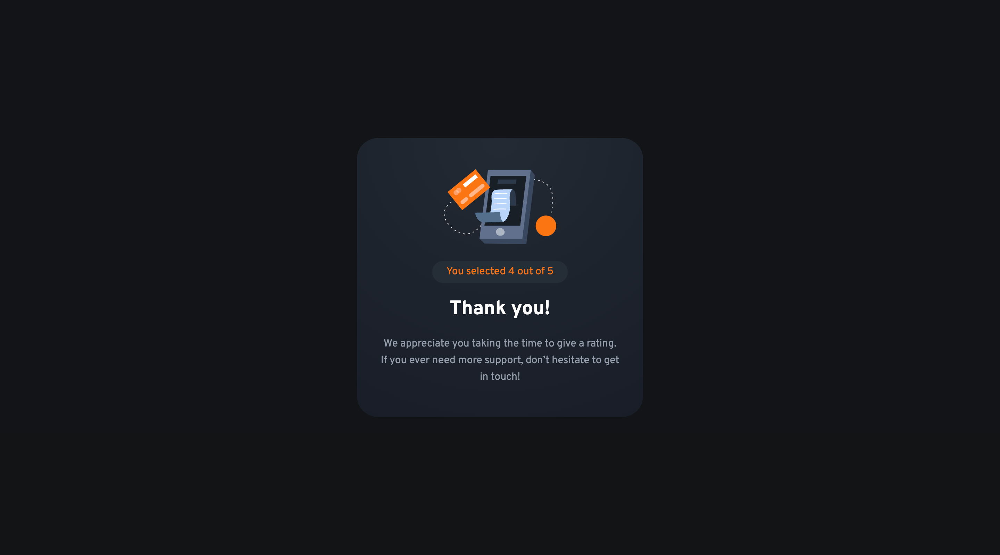

# Frontend Mentor - Interactive rating component solution

This is a solution to the [Interactive rating component challenge on Frontend Mentor](https://www.frontendmentor.io/challenges/interactive-rating-component-koxpeBUmI). Frontend Mentor challenges help you improve your coding skills by building realistic projects.

## Table of contents

- [Overview](#overview)
  - [The challenge](#the-challenge)
  - [Screenshots](#screenshots)
  - [Links](#links)
- [My process](#my-process)
  - [Built with](#built-with)
  - [What I learned](#what-i-learned)
  - [Continued development](#continued-development)
  - [Useful resources](#useful-resources)
- [Author](#author)

## Overview

### The challenge

Users should be able to:

- View the optimal layout for the app depending on their device's screen size
- See hover states for all interactive elements on the page
- Select and submit a number rating
- See the "Thank you" card state after submitting a rating

### Screenshots

|             Mobile designed at 375px:              |             Desktop designed at 1440px:             |
| :------------------------------------------------: | :-------------------------------------------------: |
|     |     |
|                Mobile (thank you):                 |                Desktop (thank you):                 |
|  |  |

### Links

- Solution URL: [https://github.com/elisilk/interactive-rating-component](https://github.com/elisilk/interactive-rating-component)
- Live Site URL: [https://elisilk.github.io/interactive-rating-component/](https://elisilk.github.io/interactive-rating-component/)

## My process

### Built with

- Semantic HTML5 markup
- CSS custom properties
- Flexbox
- CSS Grid
- Mobile-first workflow
- Fluid typography and spacing

### What I learned

This challenge was completed in the context of moving through Frontend Mentor's ["Introduction to web accessibility"](https://www.frontendmentor.io/learning-paths/introduction-to-web-accessibility-mXu-9PHVsd). Before this, I had really only done some minimal things with accessibility, like checking for the appropriate contrast between foreground and background colors, and so this was a good change of focus for me to expand the way I approach frontend development.

Given the focus on accessibility, in this challenge I leaned much more into utilizing semantically-appropriate HTML elements, especially with form inputs, and not doing anything with the styling that would undermine the built-in accessibility features that come along with those semantic elements. I think it turned out great. It was leaner HTML and JavaScript. And I guess it was good to move back to a "Newbie" level challenge after doing a fair amount of the "Junior" and "Intermediate" level ones lately.

Here are some of the resources that I made use of:

- [`reportValidity()` method](https://developer.mozilla.org/en-US/docs/Web/API/HTMLTextAreaElement/reportValidity) - Error messages weren't specified in the design. Rather than designing my own custom error handling designs, why not make use of the [built-in validation](https://developer.mozilla.org/en-US/docs/Learn/Forms/Form_validation#using_built-in_form_validation)? I did want to prevent the submit button from actually submitting the form, but I then wanted to trigger the error handling, and this seems like the perfect method for that part.
- [`radial-gradient()`](https://developer.mozilla.org/en-US/docs/Web/CSS/gradient/radial-gradient) - The design called for a radial gradient as the background for the main container. I was not 100% sure about how the specification in Figma translates into CSS, but I think I ended up with something that looks more or less correct. The Figma design file gives the two color-stops and their stop positions as a percentage. And then it seems like it using a circle shape that is focused on the top center of the container.
- [Inclusively Hiding & Styling Checkboxes and Radio Buttons](https://www.sarasoueidan.com/blog/inclusively-hiding-and-styling-checkboxes-and-radio-buttons/) - I loved this article! The clarity of the writing was excellent. But I also really appreciated the video in the ["Hiding the checkboxes inclusively"](https://www.sarasoueidan.com/blog/inclusively-hiding-and-styling-checkboxes-and-radio-buttons/#hiding-the-checkboxes-inclusively) section, that walks through the effect of each line of CSS. That was super helpful, because we are essentially hiding the built-in element, and so before doing the final step, it's great to see each prior step's impact. The case for this design challenge was a little different, because in our case, we want the radio button directly on top of the label. But the ideas were the same and because of the great explanation, were relatively straightforward to adapt for this situation.
- [a11y_styled_form_controls](https://scottaohara.github.io/a11y_styled_form_controls/) - What a great collection of accessibilty-styled form controls. Adapting these will definitely be my go-to moving forward. And Scott O'Hara's related articles are a go-to as well:
  - [Inclusive Considerations When Restyling Form Controls](https://24ways.org/2018/inclusive-considerations-when-restyling-form-controls/)
  - [One last time: custom styling radio buttons and checkboxes](https://www.scottohara.me/blog/2021/09/24/custom-radio-checkbox-again.html)
  - [Visually hidden content is a hack that needs to be resolved, not enshrined](https://www.scottohara.me/blog/2023/03/21/visually-hidden-hack.html)

### Continued development

Specific areas that the solution should be improved (known issues):

- Refine the block and inline spacing within each of the two screens. In general, it seems like the block spacing between the heading and the text content should be smaller than the block spacing between other elements on each screen. Maybe they (the headings + text) should be in a container to represent that they are connected?

More general ideas I want to consider:

- Hmm 🤔 ...

### Useful resources

- [MDN Web Docs for CSS](https://developer.mozilla.org/en-US/docs/Web/CSS) - Went here a lot to reference the different CSS properties and the shorthands, and all the great explanations about best practices.
- [MDN Guides](https://developer.mozilla.org/en-US/docs/Learn)
- [The Clamp Calculator](https://royalfig.github.io/fluid-typography-calculator/) - Used for all of fluid typography and fluid spacing calculations.

## Author

- Website - [Eli Silk](https://github.com/elisilk)
- Frontend Mentor - [@elisilk](https://www.frontendmentor.io/profile/elisilk)
